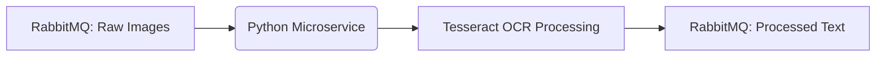
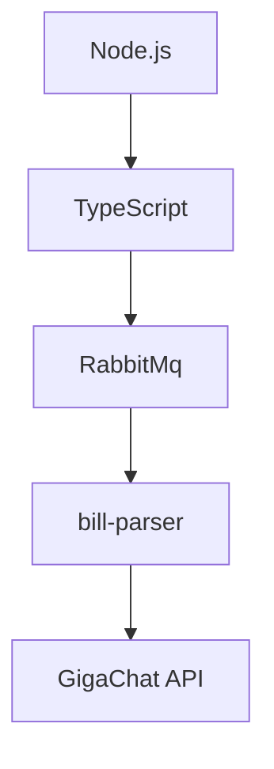
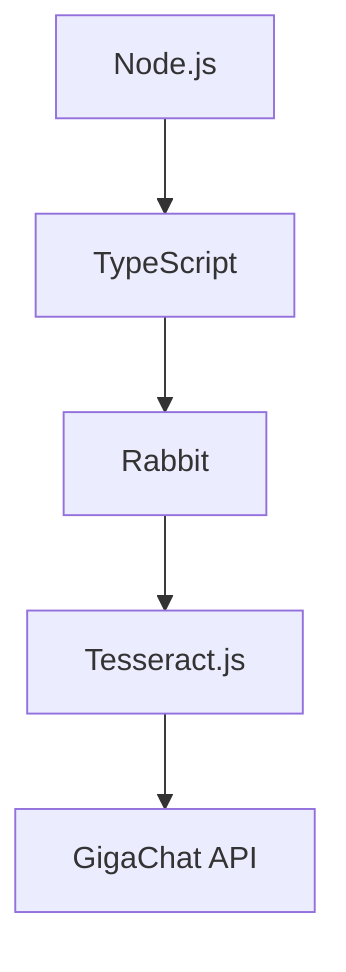

# English Version✨

# 🚀 Project Setup Guide

**Let's get your project up and running!** 🎉

## 📋 Prerequisites

- **Docker** and **Docker Compose** installed 🐳
- Basic terminal knowledge 💻

---

## 1. ⚙️ **Environment Setup**

First, create your `.env` file from the example:

```bash
cat .env.example > .env
```

Now, open .env in your favorite editor (VS Code, Nano, etc.) and fill in the missing values.
🔹 Tip: Don’t leave any required fields empty!

## 2. 🐋 Build & Run Docker

Let’s build and start everything with:

```bash
docker-compose up --build -d
```

✅ What this does:

Builds all Docker images 🏗️

Starts containers in the background 🚀

## 3. 🌐 Access the Project

🎯 Main Website:
👉 [resonancetech.ru](resonancetech.ru)

📖 API Documentation (Swagger):
👉 [resonancetech.ru/docs](resonancetech.ru/docs)

🛠 Handy Commands
⏹ Stop containers:

```bash
docker-compose down
```

📜 Check running containers:

```bash
docker-compose ps
```

📢 View logs (live updates):

```bash
docker-compose logs -f
```

❓ Need Help?
😊 Contact your dev team or open an issue!

---

# **Русская Версия** ✨

# 🚀 Руководство по запуску проекта

**Давайте развернём ваш проект!** 🎉

## 📋 Что нужно перед стартом

- Установленные **Docker** и **Docker Compose** 🐳
- Базовые знания терминала 💻

---

## 1. ⚙️ **Настройка окружения**

Сначала создайте файл `.env` из примера:

```bash
cat .env.example > .env
```

Теперь откройте .env в любом редакторе (VS Code, Nano и др.) и заполните недостающие значения.
🔹 Совет: Не оставляйте обязательные поля пустыми!

## 2. 🐋 Сборка и запуск Docker

Собираем и запускаем проект командой:

```bash
docker-compose up --build -d
```

✅ Что произойдёт:

Соберутся все Docker-образы 🏗️

Контейнеры запустятся в фоне 🚀

## 3. 🌐 Доступ к проекту

🎯 Основной сайт:
👉 [resonancetech.ru](resonancetech.ru)

📖 Документация API (Swagger):
👉 [resonancetech.ru/docs](resonancetech.ru/docs)

🛠 Полезные команды
⏹ Остановить контейнеры:

```bash
docker-compose down
```

📜 Посмотреть работающие контейнеры:

```bash
docker-compose ps
```

📢 Читать логи (в реальном времени):

```bash
docker-compose logs -f
```

❓ Нужна помощь?
😊 Обратитесь к команде разработчиков или создайте задачу!

# About bill-parser servicce

---



# English Version✨

## 🔄 Workflow Diagram

## 📄 OCR Receipt Processor Microservice

**✨ Transforms images into text like magic!**

### 🏆 **What It Does**

This microservice:

1. 📥 **Consumes** images (receipts/scans) from a RabbitMQ queue
2. 🔍 **Processes** them using Tesseract OCR (Optical Character Recognition)
3. ✨ **Extracts** text data from the images
4. 📤 **Publishes** the structured receipt data back to RabbitMQ

---

### 🛠 **Tech Stack**

- **Python 3.10+** 🐍
- **RabbitMQ** (message broker) 🔴
- **Tesseract OCR** (text extraction) 🔍

---

# **Русская Версия** ✨

# 📄 Микросервис обработки чеков (OCR)

**✨ Волшебным образом превращает изображения в текст!**

## 🎯 **Функционал**

Этот микросервис:

1. 📥 **Получает** изображения чеков из очереди RabbitMQ
2. 🔍 **Обрабатывает** их через Tesseract OCR (оптическое распознавание)
3. ✨ **Извлекает** текстовые данные
4. 📤 **Отправляет** структурированные данные чека обратно в RabbitMQ

---

## 🛠 **Технологии**

- **Python 3.10+** 🐍
- **RabbitMQ** (брокер сообщений) 🔴
- **Tesseract OCR** (распознавание текста) 🔍

---

# 🚀 About bill-server (TypeScript)

# 🔄 Workflow

```
sequenceDiagram
    Client->>+Microservice: POST /process {imageUrl}
    Microservice->>+Rabbit: Add to queue
    Rabbit-->>-Worker: Process image
    Worker->>+OCR: Extract text
    OCR-->>-Worker: Raw text
    Worker->>+GigaChat: Enhance text
    GigaChat-->>-Worker: Structured data
    Worker->>+Rabbit: Store result
    Rabbit-->>-Client: Return via webhook
```

# English Version✨

**✨ Smart image processing with OCR & AI enrichment!**

## 🌟 **Features**

- 📤 Sends image URLs to RabbitMQ
- 📥 Receives raw OCR results from queue
- 🧠 Enhances text with GigaChat AI
- � Returns structured data to client

## 🛠️ **Tech Stack**



# **Русская Версия** ✨

# 🚀 Микросервис обработки изображений (TypeScript)

**✨ Умная обработка изображений с OCR и AI!**

## 🌟 **Возможности**

- 📤 Отправка URL изображений в Rabbit
- 📥 Получение сырых данных OCR
- 🧠 Улучшение текста через GigaChat
- 🏓 Возврат структурированных данных

## 🛠️ **Технологии**


